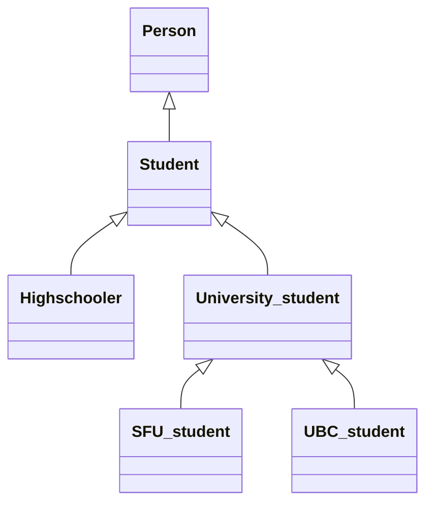

#terminology

## Definition
A style of diagram that shows classes and their inheritance relations.

Class diagrams can be quite elaborate, e.g. showing the names of methods and member variables, what is public/private, and even kinds of class relationships other than inheritance. However, for this course we will only occasionally use very simple class diagrams.

When designing a large program with many classes, class diagrams can be a useful tool for sketching the overall structure of the classes in the program.

## Example 1
Each box holds the name of a class, and arrows indicate inheritance, e.g. the `Student` class inherits from the `Person` class, and the `SFU_student` class inherits from `University_student`.

## Example 2
![[printableClassDiagram.svg]]