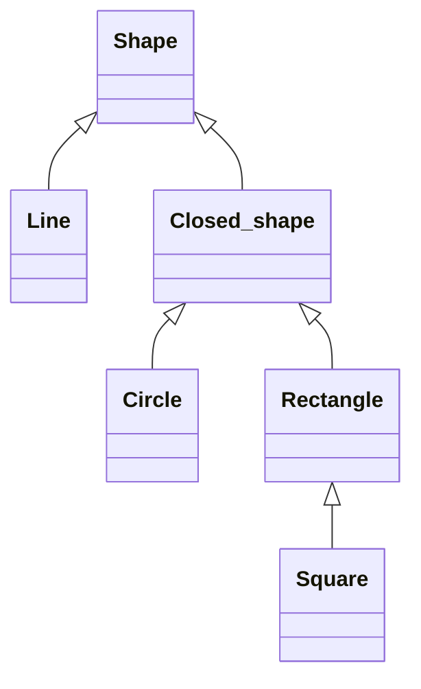

#terminology

## Definition
A collection of classes related to each other in a hierarchical way using inheritance. [[class diagram|Class diagrams]] can be used to visualize class hierarchies.

## Example
Suppose you are writing a program that represents shapes. It might have these classes:
- A base class called `Shape`.
- A class called `Line` that inherits from `Shape`.
- A class called `Closed_shape` that inherits from `Shape`.
- Classes `Circle` and `Rectangle` inherit from `Closed_shape`.
- Class `Square` inherits from `Rectangle`.

